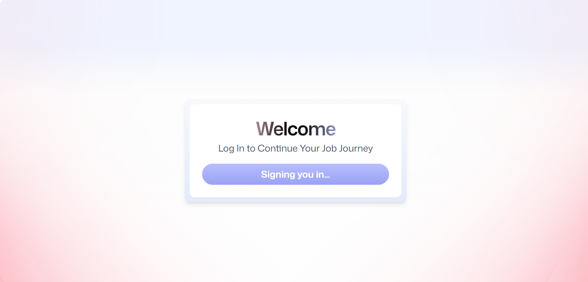
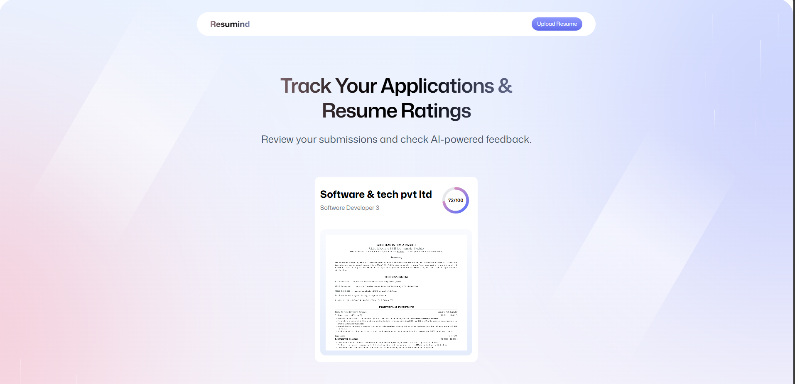
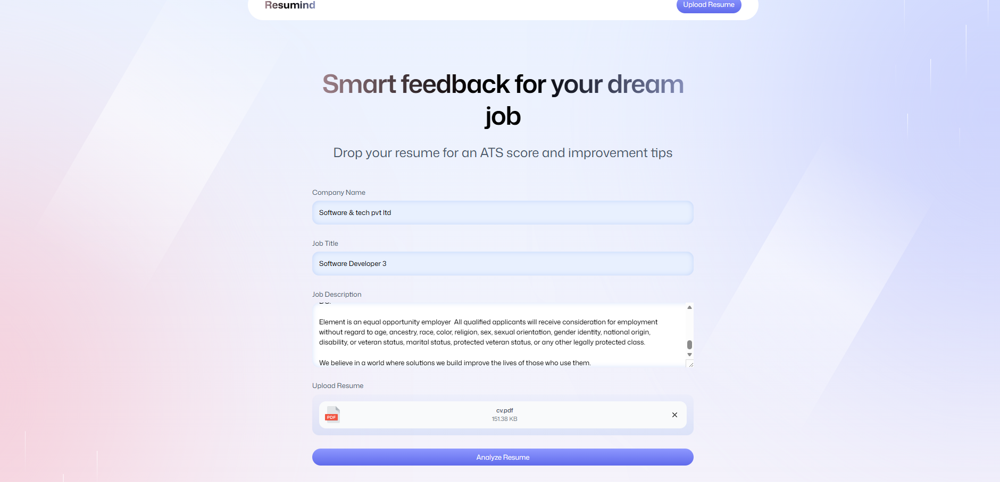
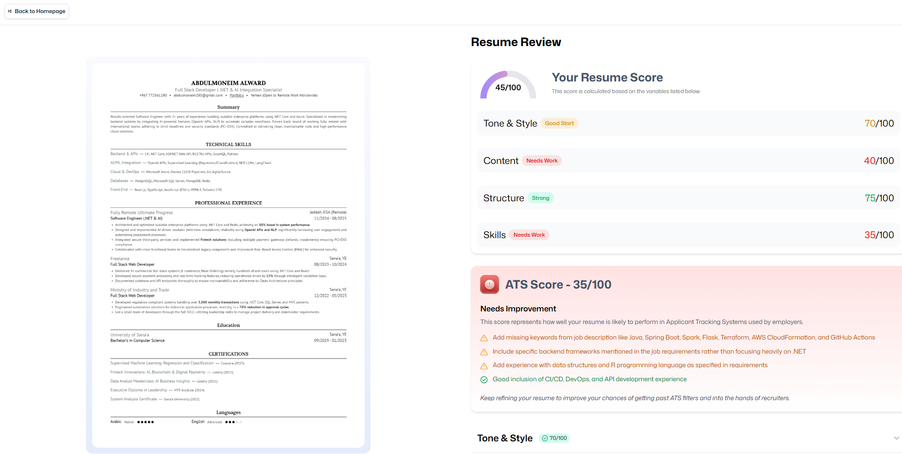

# 🚀 Resumind — AI Resume Analyzer

**Resumind** is a production-ready full-stack application that analyzes resumes using AI and provides ATS-optimized feedback, scoring, and actionable improvement suggestions tailored to specific job descriptions.

The application leverages **React Router SSR**, **Puter.js Backend-as-a-Service**, and modern UI tooling to deliver a scalable resume intelligence platform.

## 📸 Screenshots

### Sigin In


### Main Page


### Upload Resume


### AI Analysis Results


---

## ✨ Features

* 🤖 **AI Resume Analysis**
  Advanced AI evaluates resume quality, structure, tone, and skills.

* 📊 **ATS Compatibility Scoring**
  Calculates an ATS-optimized score and highlights missing keywords.

* 📄 **PDF Resume Processing**
  Converts uploaded resumes into high-resolution previews for analysis.

* 🔐 **Secure Authentication**
  Integrated authentication powered by Puter.js.

* ☁️ **Cloud Storage & Persistence**
  Resume files, images, and analysis results stored using Puter FS & KV.

* 🔗 **Shareable Resume Analysis Links**
  Generate persistent analysis entries that can be revisited anytime.

* ⚡ **Server-Side Rendering (SSR)**
  Built with React Router full-stack architecture for fast rendering.

---

## 🧱 Architecture Overview

```
Frontend (React + Tailwind)
        │
        │ React Router SSR
        ▼
Application Server
        │
        │ Puter.js SDK
        ▼
Puter Cloud Services
   • Auth
   • File System
   • KV Database
   • AI Models
```

---

## 🛠 Tech Stack

**Frontend**

* React 19
* React Router Full-Stack
* TypeScript
* Tailwind CSS
* Zustand State Management
* Framer Motion

**Backend / Services**

* Puter.js (Auth, AI, File Storage, KV Store)
* PDF.js document processing

---

## 📦 Installation

Clone the repository:

```bash
git clone https://github.com/almoneim80/cv-lens
cd cv-lens
```

Install dependencies:

```bash
npm install
```

Run development server:

```bash
npm run dev
```

Application will run at:

```
http://localhost:5173
```

---

## 🏗 Production Build

```bash
npm run build
```

The production output:

```
build/
 ├── client/
 └── server/
```

Deploy using any Node-supported platform or Docker.

---

## 🐳 Docker Deployment

```bash
docker build -t resumind .
docker run -p 3000:3000 resumind
```

Supported platforms:

* AWS ECS
* Google Cloud Run
* Azure Container Apps
* Railway
* Fly.io
* DigitalOcean App Platform

---

## 📁 Project Structure

```
CV-LENS/
│
├── app/
│   ├── components/        # Reusable UI components
│   ├── lib/               # Utilities, integrations, helpers
│   ├── routes/            # Route modules (React Router SSR)
│   ├── app.css
│   ├── root.tsx
│   └── routes.ts
│
├── constants/             # Application constants
├── public/                # Static assets
├── types/                 # Global TypeScript types
│
├── Dockerfile
├── package.json
├── react-router.config.ts
├── tsconfig.json
├── vite.config.ts
└── README.md
```

The project follows a React Router full-stack architecture where route modules act as server/client boundaries while Puter.js handles backend services including authentication, storage, and AI inference.
---

## ⚙️ Environment Requirements

* Node.js 18+
* Puter account
* Modern browser supporting Web Workers

---

## 🧠 How the Analysis Works

1. User uploads resume (PDF)
2. Resume converted to image preview
3. AI analyzes:

   * ATS matching
   * Skills relevance
   * Content quality
   * Structure
   * Tone & clarity
4. Feedback is stored in cloud KV store
5. Results displayed with score dashboards

---

## 🤝 Contributing

1. Fork the repository
2. Create feature branch
3. Commit changes
4. Open Pull Request

---

## 📄 License

MIT License

---

## 👨‍💻 Author

**Abdulmonim Alward**

GitHub: https://github.com/almoneim80

Project: https://github.com/almoneim80/cv-lens

Website: https://moneim.vercel.app/

---

## ⭐ Support
If you find this project useful, consider starring the repository to support development.
